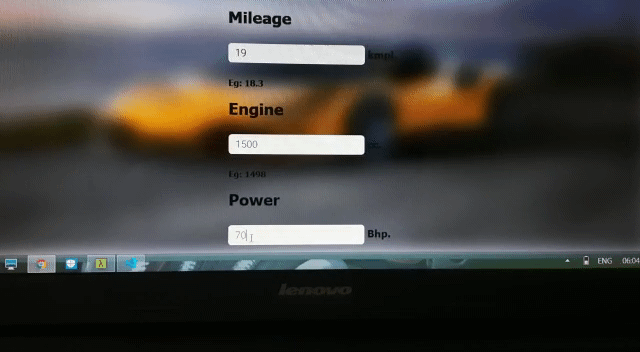

# Project

This is a portfolio Machine Learning Project based on advanced regeresion techniques to predict the market rate of used cars in the Indian car market .
### This project is divided into specifically 3 steps .
##### 1) Exploratory data analysis and Model creation.
##### 2) Server side app. or Rest API creation.
##### 3) Deploying our Model as a usable one in web.

Special acknowledgement to Kaggle Dataset.

###### Later on we have special priorities and interest in developing our own dataset & Maintaining our model engine.

#### The entire web app is deployed as 

#### http://ec2-3-137-149-183.us-east-2.compute.amazonaws.com/
